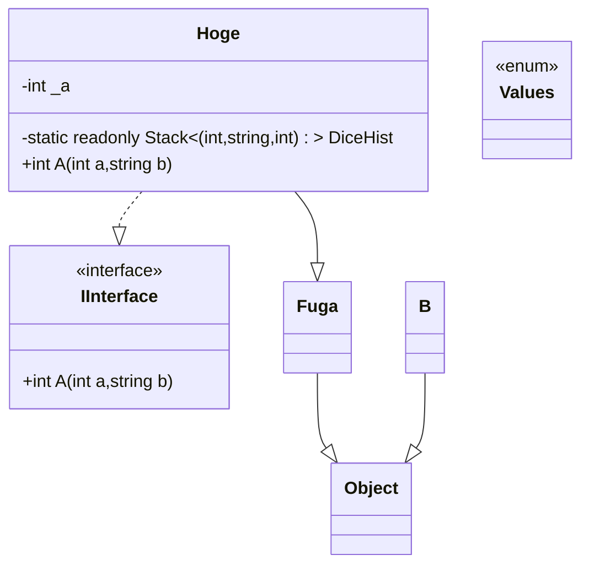

```mermaid
    classDiagram

    class Hoge{
       -static readonly Stack<(int,string,int)> DiceHist
       -int _a
       +int A(int a,string b)
   }

    class Values{
    <<enum>>
   }

    class IInterface{
    <<interface>>
       +int A(int a,string b)
   }

    class Fuga{
   }

    class B{
   }
Hoge --|> Fuga
Hoge ..|> IInterface
Fuga --|> Object
B --|> Object
```