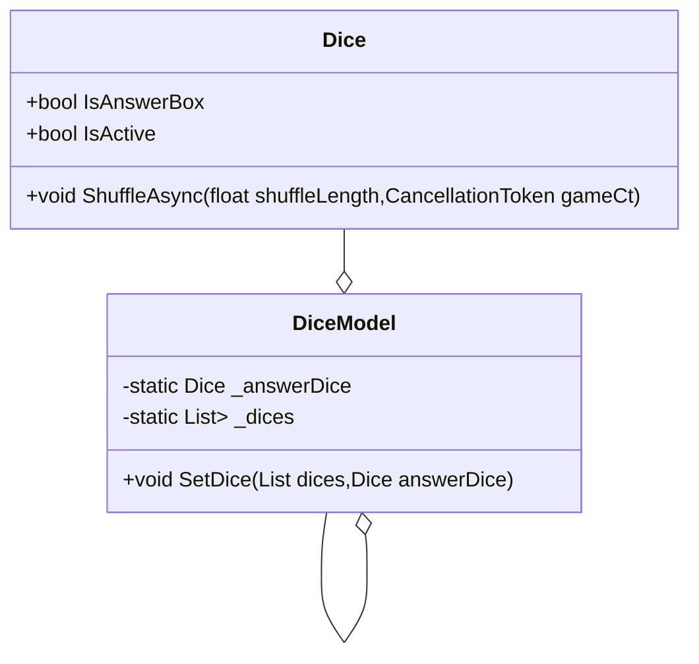

```mermaid
    classDiagram

    class DiceModel{
       -static Dice _answerDice
       -static List<Dictionary<Dice,DiceModel>> _dices
       +void SetDice(List<Dice> dices,Dice answerDice)
   }

    class Dice{
       +bool IsAnswerBox
       +bool IsActive
       +void ShuffleAsync(float shuffleLength,CancellationToken gameCt)
   }
Dice --o DiceModel
DiceModel --o DiceModel
```